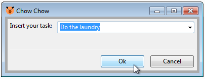
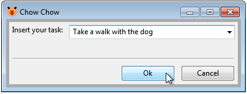
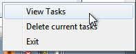
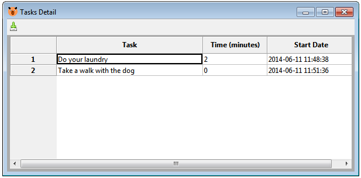
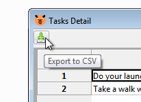

#  ChowChow #

ChowChow it's a simple tool to track time spent on tasks.

## How to use ##

**1-** Insert your task

**2-**  Do some work

**3- Click** on the taskbar icon

**4-** Insert your **new task**

**4-** Do some other stuff

**5-** Repeat steps **1** to **4** if not done

**6-** When done **right click** on the taskbar icon and click on **View Tasks** menu to see the Task Details window

**7-** Export to csv in case you need do more with the data

## Installation ##

These are the flavors of Chow Chow:

### Windows ###

Download and extract the corresponding archive in the next links and execute **chowchow.exe**:

[chow-chow-0.0.1-alpha-win32.zip](https://dl.dropboxusercontent.com/u/34045080/chow-chow/chow-chow-0.0.1-alpha-win32.zip)

[chow-chow-0.0.1-alpha-win64.zip](https://dl.dropboxusercontent.com/u/34045080/chow-chow/chow-chow-0.0.1-alpha-win64.zip)

### Linux ###

Download and extract the archive in the next link and execute **chowchow**:

[chow-chow-0.0.1-alpha-linux.tar.gz](https://dl.dropboxusercontent.com/u/34045080/chow-chow/chow-chow-0.0.1-alpha-linux.tar.gz)

#### Issues ####

In some distributions are issues with the fonts we recommend you to use python directly in those cases.

## Development ##

In order to enhance programmer productivity without the license limitations of some other platform and
generate with (almost) no pain a multi-platform GUI tool we use [Python](https://www.python.org/) and
[wxPython](http://www.wxpython.org/) for the development of ChowChow.

Also [wxFormBuilder](http://sourceforge.net/projects/wxformbuilder/) it's used for the generation and edition of some
of the GUI components.

[PyInstaller](http://www.pyinstaller.org/) it's used to construct the binary executables.

### Requeriments ###

- [Python 2.7.6+](https://www.python.org/)
- [wxPython 3.0+](http://www.wxpython.org/)
- [Git 2.8+](http://git-scm.com/)
- [PyInstaller](http://www.pyinstaller.org/) (optional)
- [wxFormBuilder](http://sourceforge.net/projects/wxformbuilder/) (recommended)
- A strong will to conqer the world :)

